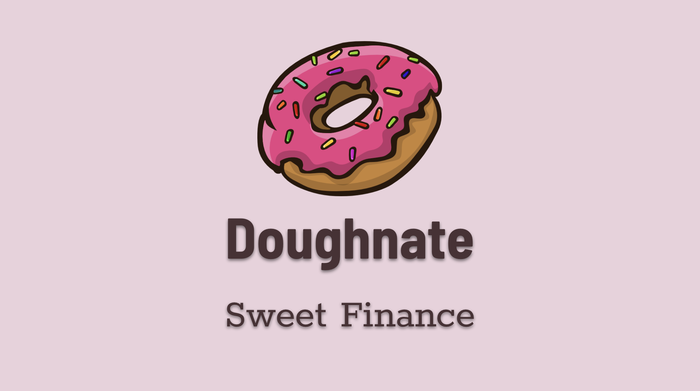
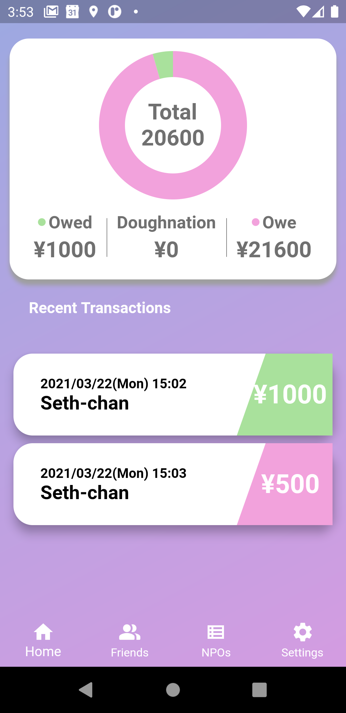
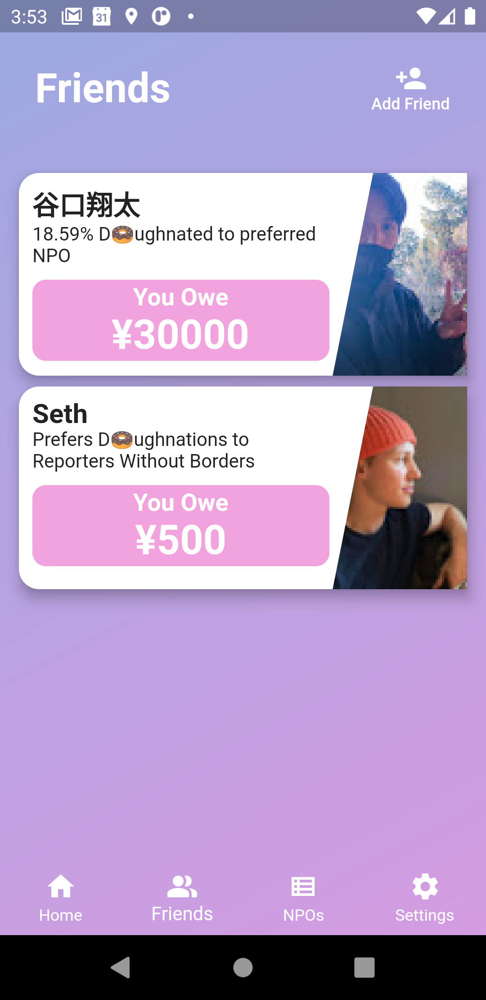
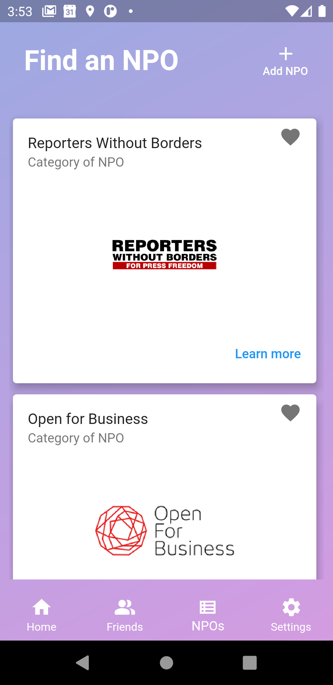
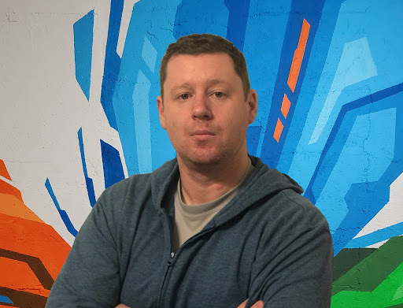
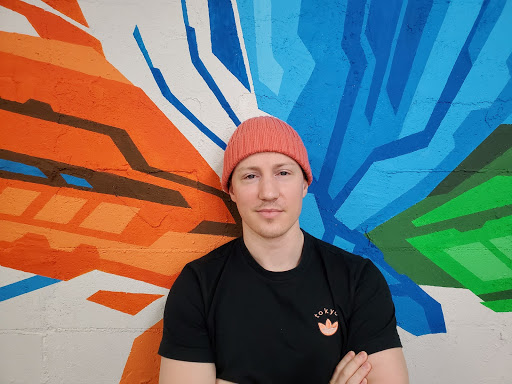

## 

---

#### Doughnate is a social debt tracking app with a twist! Choose charitable organizations and have your friends donate to them on your behalf in place of paying you back! Let's make finance a little sweeter for everyone!

---

## Table of contents

- [General info](#general-info)
- [Screenshots](#screenshots)
- [Technologies](#technologies)
- [Setup](#setup)
- [Features](#features)
- [Status](#status)
- [Inspiration](#inspiration)
- [Contact](#contact)

## General info

Doughnate came out of interest to motivate people to participate more in social causes. Everyone in their groups of friends exchange little debts, and we wanted to take those little debts and give them a bigger purpose. Find an NPO that you care about or submit one that you'd like to be reviewed!

## Screenshots

  
  &nbsp; &nbsp;
  
  &nbsp; &nbsp;
  

## Technologies

## Setup

1. Fork and close this repo
2. Start up on your editor of choice
3. Ensure you have an android emulator
4. Set up your Firebase project

Run the below code in your terminal or use Android Studio GUI to run the package.

`Flutter run`

## Features

- Sign in through google account
- Add friends
- Adjust debt between friends
- Learn more about NPOs
- Doughnate on your friends behalf

To-do list:

- Pay NPOs directly in app
- More customization for color scheme

## Inspiration

Initial idea inspired by expense tracking applications like SplitWise.

## Contact Team Solid State

  

    <h3>Nick - Tech Lead/Fullstack</h3>
    
     
    
    
  

    <h3>Shota - Fullstack</h3>
    
     
    
    
  

    <h3>Seth - Fullstack</h3>
    
     
    
    
  

